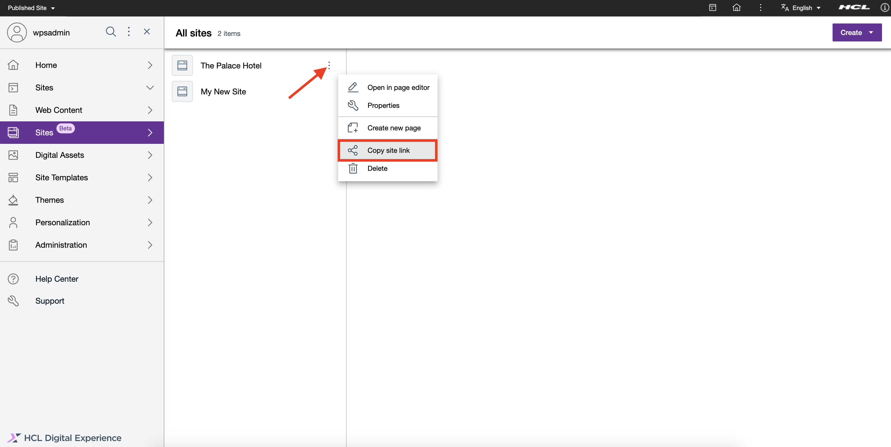
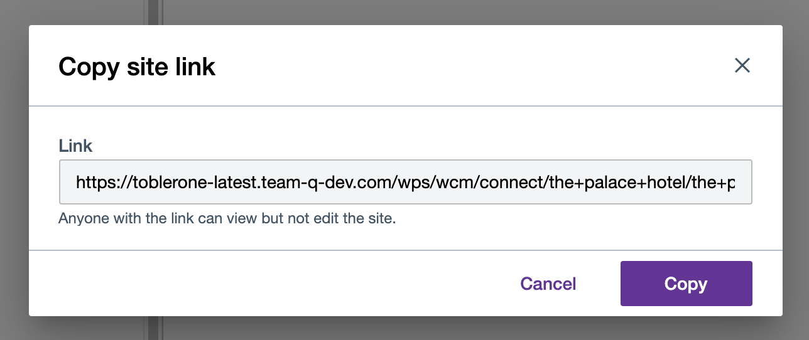
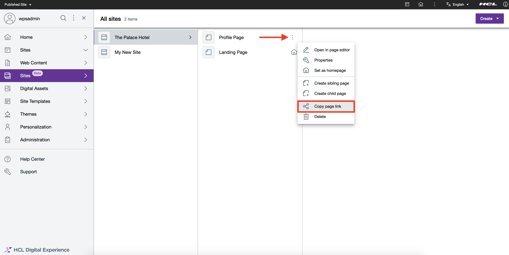
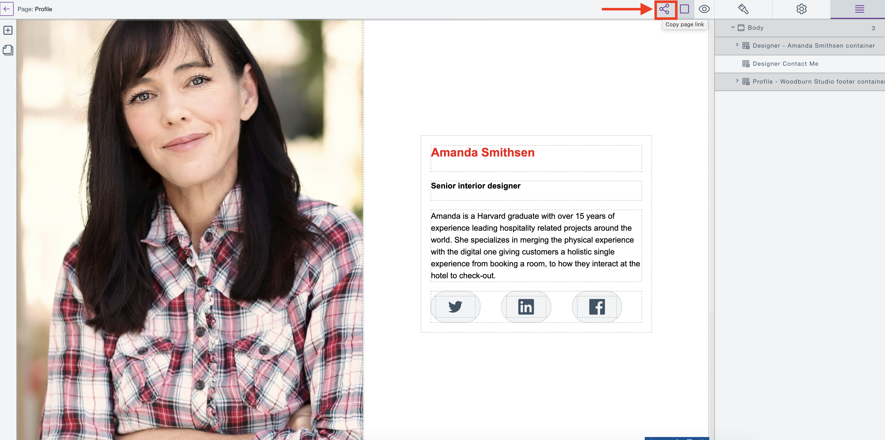

# Render your site
The following outlines how to render a site built using HCL Design Studio (Beta).

## Prerequisite
Design Studio (Beta) is available for evaluation use and may not be used in production. It may be installed and configured to HCL Digital Experience 9.5 container release update CF196 or higher. See instructions to install Design Studio (Beta) in [Install Design Studio (Beta)](ds_installing.md).

Design Studio (Beta) is accessible from the Practitioner Studio interface, after image configuration to your HCL Digital Experience 9.5 CF196 or higher deployment.

## URL conventions
When designing a site or a page within a site, you can render the site or page for an end user.

The following are the URL conventions when rendering a site or page within the provided Palace Hotel demo site as of HCL Digital Experience 9.5 CF199 and higher releases:

1.  Default page: <code><WCMHost\>/<WCMContextRoot\>/<Library\>/<Site\></code>
    -   Sample Authenticated: <code>https://mydx.com/wps/wcm/myconnect/design+studio+demo/the+palace+hotel/</code>
    -   Sample Anonymous: <code>https://mydx.com/wps/wcm/connect/design+studio+demo/the+palace+hotel/</code>
2.  Custom site page created from the provided Palace Hotel demo site: <code><WCMHost\>/<WCMContextRoot\>/<Library\>/<Site\>/<Page\></code>
    -   Sample Anonymous: <code>https://mydx.com/wps/wcm/connect/design+studio+demo/the+palace+hotel/mypage</code>

The URL may also be retrieved as part of the `Content-sites` and `Content-pages` endpoints.

!!! sample
    ```
        "properties": {
                "relativeUrlPath": "test2",
                "renderURL": "/wps/wcm/connect/design+studio+demo/the+palace+hotel/test2"
                }
    ```

## Authorization
The out-of-the-box default site is not accessible for anonymous users. If you are granting anonymous user role access to the complete library, the default site can also be rendered anonymously.

!!! note
    For HCL Digital Experience 9.5 CF197 and earlier releases, an authentication module has not been implemented. The default WCM login shows without authentication or if you do not have the sufficient user permissions.

## Markup
The rendered HTML contains a head section with the CSS references and a body with the content from the site and page and containers on the page.

The title is set based on the page title.

## Limitations
This feature renders your HCL Design Studio site as a basic HTML site. As such, it has the following limitations:

-   Custom login is not supported.
-   Site is either rendered for all anonymous or all authenticated users.
-   Authorized users are unable to handle session timeout.
-   The HCL Design Studio (Beta) site has no Search Engine Optimization (SEO) capabilities.

## Rendering sequence
During site rendering, the CSS will be added to the head section of the page in the following order:

1.  Site Baseline Stylesheet
2.  Site Stylesheet
3.  Page Stylesheet
4.  Container Stylesheets (in the same order they appear in the page)

This order provides flexibility and allows the user to override any class selector from the site baseline stylesheet through the HCL Design Studio \(Beta\) Page editor.

## Get the live URL of the rendered site

!!! note
    Any changes to the site name will generate a new URL.

1.  From the **Sites** overview, navigate to the selected site.

2.  Hover and click the overflow (3-dot) menu button of the selected site, and click **Copy site link**.

    

3.  A dialog appears where you can double-click and copy the site URL like you do in a typical text editor manually, as shown below.

    

    You may also click the **Copy** button to copy the URL and dismiss the dialog at the same time.

4.  The URL is now copied to your system clipboard.


## Get the live page URL of the rendered site
!!! note
    Any changes to the page will generate a new URL.

There are four ways how to get the live page URL to open the rendered HCL Design Studio page.

### From the selected page overflow menu in Sites overview
  1.  In **Sites** overview, navigate to the page which you want to get the URL as shown above.
  
  2.  Hover and click the overflow (3-dot) menu button, and then click **Copy page link**.

      

  3.  A dialog appears where you can double-click and copy the page URL like you do in a typical text editor manually, as shown below.

      

      You may also click the **Copy** button to copy the URL and dismiss the dialog at the same time.

  4.  The URL is now copied to your system clipboard.

### From the Page Properties panel
  1.  In **Sites** overview, navigate to the page which you want to get the URL as shown above.
    
  2.  Hover and click the overflow (3-dot) menu button of the selected page.
   
  3.  Click **More**, then **Copy page link**.

      

  4.  A dialog appears where you can double-click and copy the page URL like you do in a typical text editor manually.

      You may also click the **Copy** button to copy the URL and dismiss the dialog at the same time.

  5.  The URL is now copied to your system clipboard.

### In Page editor
  1.  From the **Sites** overview, navigate to the page you want to edit and open it in the page editor.
  
  2.  On the page editor, locate and click the **Open page link** icon, which is on the top toolbar.

      

  3.  A dialog appears where you can double-click and copy the URL like you do in a typical text editor manually.

      You may also click the **Copy** button to copy the URL and dismiss the dialog at the same time.

  4.  The URL is now copied to your system clipboard.

### From the Page editor > Pages panel
  1.  On the page editor, move your cursor to the left and click the **Pages** icon to open the Pages panel.
  
  2.  Select the page, click the overflow (3-dot) menu button, and then click **Copy page link**, as shown below.

      

  3.  A dialog appears where you can double-click and copy the URL like you do in a typical text editor manually.

      You may also click the **Copy** button to copy the URL and dismiss the dialog at the same time.

  4.  The URL is now copied to your system clipboard.

## How to present your feedback on HCL Design Studio (Beta)
HCL Digital Experience welcomes your feedback and suggestions on Design Studio (Beta), and encourages you to present your input through cases and discussions with HCL Support DX leaders.
