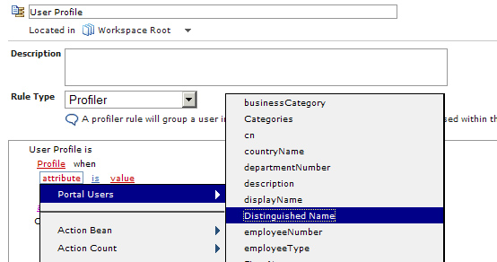

# The Portal User resource collection 

The Portal User resource collection uses public APIs provided by HCL Digital Experience to access user information.

The Portal User resource collection allows rules to be written based on all properties of the HCL Portal user.



You can also use the Portal User resource collection to profile based on the property extension database. Use the **Manage Properties** menu option in the rule editor to add or remove dynamic or Lookaside properties from the collection. You may add any properties to this collection, but for them to function at runtime some values must be stored in Virtual Member Manager for the properties being used and the user executing the rule. The Manage Properties screen can also be used if the server on which you author rules has a different Virtual Member Manager configuration than the one on which the rules are deployed.

The resource collection is not new to HCL Portal 8.5, but it now shows the list of Portal User attributes automatically. You no longer have to add each HCL Portal property you want to use as a dynamic property in the Personalization rule editor. You do not need to generate Java™ code to use this collection or configure a security ID translator as is often required for Personalization User collections. You cannot currently write rules to select or recommend a list of users from this collection. This collection works with update rules as long as your repository allows writes. The collection works as if it is an LDAP collection that is automatically configured for the LDAP server.

You may continue to use your existing SQL Server, LDAP or custom user resource collections, and even use them in the same rules as the Portal User Collection. This is useful if you have multiple user repositories, you a have repository that is generally not used for Portal and only used for Personalization rules, or you requirements for attribute value translation \('CHI' should be interpreted as 'Chicago' for instance\).

## Using the Groups Attribute

The Groups attribute on the Portal User object exposes the distinguished names \(dn\) of the groups. An example of a distinguished name of a group is `cn=wpsadmins,o=defaultWimFileBasedRealm`, though the exact form will vary by your installation. Using distinguished name allows for more exact matching of groups, since it is possible for two groups to share a common name, such as `wpsadmins`. The `includes` operator may be used for inexact string matching, but will perform slightly slower. When possible, use the `is` operator and match to the distinguished name of the group.

## Adding and extending user attributes

You can make attributes from your user registry available to the personalization portlet as required. However, in most cases the schema for your user registry does not match the default schema for Virtual Member Manager \(VMM\). For this reason, you must first extend the default VMM schema by adding attributes that you must then map from the VMM schema to your user registry.

Do the following to make user attributes available:

1.  Extend the default VMM schema by adding attributes that you can map to your user registry. For instructions, see the following topic in the Installation section of this Information Center: *Adding attributes*. Refer to the topic that corresponds to your operating system and environment configuration.
2.  Map the attributes you added to the VMM schema to the attributes in your user registry. For instructions, see the following topic in the Installation section of this Information Center: *Mapping attributes*. Refer to the topic that corresponds to your operating system and environment configuration.

## Configuring which properties show up for the Portal User Collection

The Personalization rule editor discovers the list of properties to show in rules through a public API \(`com.ibm.portal.um.PumaProfile)`. The list exposed by this API is configurable in your Member Manager configuration.

You may have a long list of properties that are available on the portal user, but do not want all of them to show up in the Personalization rule editor. For this purpose, set the property wmm.property.hide in the file [wp\_profile\_root](../reference/wpsdirstr.md#wp_profile_root)/PortalServer/config/config/services/PersonalizationService.properties as illustrated in this example:

```
# Use this configuration property to control which WMM properties show
# in the Personalization rule editor. wmm.property.hide will only
# hide those properties which are introspected from the WMM configuration.
wmm.property.hide=mobile,pager,roomNumber,secretary,carLicense,telephoneNumber,
facsimileTelephoneNumber,seeAlso,userPassword,ibm-firstWorkDayOfWeek,
ibm-alternativeCalendar,ibm-preferredCalendar,ibm-firstDayOfWeek,ibm-primaryEmail,
ibm-otherEmail,ibm-generationQualifier,labeledURI,createTimestamp,
modifyTimestamp,ibm-middleName,ibm-timeZone,initials,jpegPhoto,WCM\:USERDATA,groups

```

## The Portal User collection and the Personalization Server installed without Portal

The Portal User collection can only be used in rules running within a HCL Portal installation. The system will not prevent you from publishing rules using this collection to a Personalization Server installed outside of HCL Portal, but the rules will not function in this environment since Virtual Member Manager is not available. When HCL Portal is installed, the security context of the logged in user must have access \(through Portal resource permissions\) to the user information being accessed through the collection.

**Parent topic:**[Digital Experience Personalization ](../pzn/pzn_overview.md)

**Previous topic:**[The Web Content resource collection ](../pzn/pzn_wcm_rescoll.md)

**Next topic:**[LikeMinds Recommendations ](../pzn/pzn_intro_likeminds.md)

**Parent topic:**[Digital Experience Personalization ](../pzn/pzn_overview.md)

**Previous topic:**[The Web Content resource collection ](../pzn/pzn_wcm_rescoll.md)

**Next topic:**[LikeMinds Recommendations ](../pzn/pzn_intro_likeminds.md)

