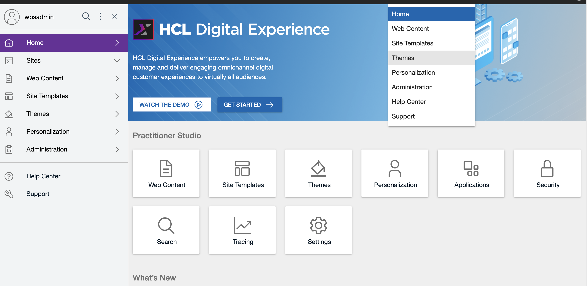
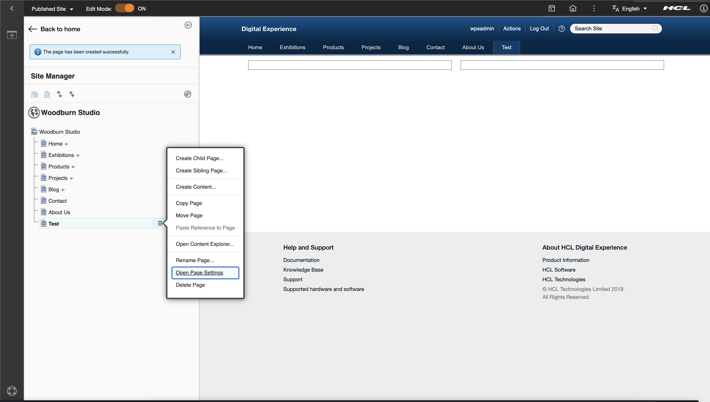
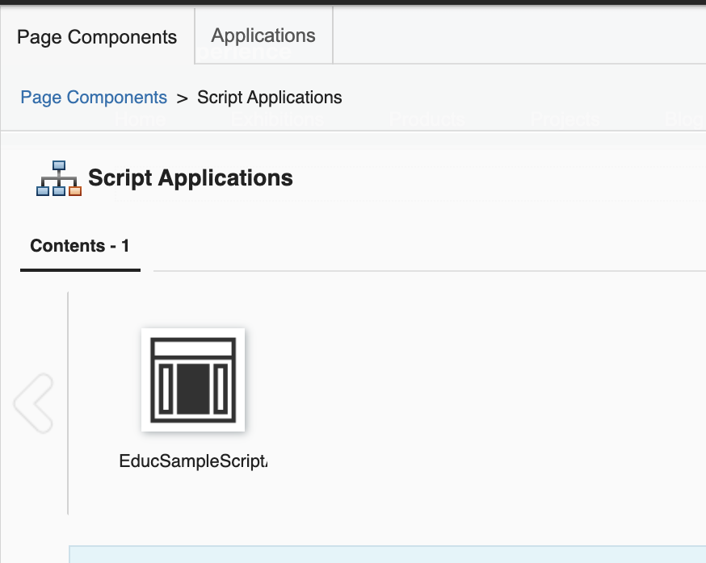

# How To Deploy a React App to DX as a ScriptApp

## Overview

This guide will describe the steps on how to deploy a built React app into DX to become a ScriptApp.

NOTE: Migration to [Webpack](https://webpack.js.org/)  is optional and is only done as preparation for advanced deployments. The sample WebPack config included is intended for quick deployments that combines all dependencies along with actual apps files.

For optimal loading of multiple DX ScriptApps in a single page, custom Webpack bundling is needed please see: [How To Deploy Multiple Apps with Shared Dependencies](../04AppsWithSharedDependencies).

## PreRequisites
1. Follow the online guide on how to install HCL DXClient [DX9.5](https://help.hcltechsw.com/digital-experience/9.5/containerization/dxclient.html). Please note that the DX and/or DXClient link provided here may be superseded, you may use a newer version if available.

2. Add the 'Script Application Library' to the list of visible libraries in your DX Library Explorer. Follow the series of links via the Web Content menu: Preferences -> Edit Shared Settings. Don't forget to click on the OK button.
   
   
   

3. Make sure that the following module ids are included in the target theme profile for the pages that will contain the scriptapp:
    1. "wp_react_16_10_2",
    2. "wp_react_dom_16_10_2",
    3. "wp_react_router_dom_512"

   
   
   

## Setup

1. Update the project [package.json](sample-app/package.json) file to add the dxclient parameters as config. Double-check and update the config values as needed. Also, add the deploy-dx-app line as-is among the scripts. The variables in the scripts will automatically pick up the values from environment variables and config.

    ```
    {
        ...
        "config": {
           "dxclient": {
               "wcmContentName": "EducSampleScriptApp01",
               "wcmSiteArea": "Script Application Library/Script Applications",
               "mainHtmlFile": "index.html",
               "contentRoot": "./build",
               "protocol": "https",
               "hostname": "localhost",
               "port": "10041"
           }
        },
        "scripts": {
            ...
            "dx-deploy-app": "dxclient deploy-scriptapplication push -dxUsername $dxUsername -dxPassword $dxPassword -wcmContentName \"$npm_package_config_dxclient_wcmContentName\" -wcmSiteArea \"$npm_package_config_dxclient_wcmSiteArea\" -mainHtmlFile $npm_package_config_dxclient_mainHtmlFile -contentRoot \"$npm_package_config_dxclient_contentRoot\" -dxProtocol $npm_package_config_dxclient_protocol -hostname $npm_package_config_dxclient_hostname -dxPort $npm_package_config_dxclient_port"
            ...
        },
        ...
    }
    ```
2. Build your application as-usual:

        cd <app-folder>
        npm install
            * Note: to fix upstream dependency conflict, try the command with --force or --legacy-peer-deps.
        npm run build

3. Execute the npm script dx-deploy-app, pre-set with the DX admin username and password.

        dxUsername=<username> dxPassword=<password> npm run dx-deploy-app
            > sample-app@0.1.0 dx-deploy-app
            > dxclient deploy-scriptapplication push -dxUsername $dxUsername -dxPassword $dxPassword -wcmContentName "$npm_package_config_dxclient_wcmContentName" -wcmSiteArea "$npm_package_config_dxclient_wcmSiteArea" -mainHtmlFile $npm_package_config_dxclient_mainHtmlFile -contentRoot "$npm_package_config_dxclient_contentRoot" -dxProtocol $npm_package_config_dxclient_protocol -hostname $npm_package_config_dxclient_hostname -dxPort $npm_package_config_dxclient_port

            2022-08-08 21:13:36 : Begin content push to Portal.
            2022-08-08 21:13:36 : WCM content ID: .
            2022-08-08 21:13:36 : WCM Content Path: .
            2022-08-08 21:13:36 : WCM Content Title: .
            2022-08-08 21:13:36 : Main HTML file: index.html.
            2022-08-08 21:13:36 : PrebuiltZip path does not exist.
            2022-08-08 21:13:36 : Archive file:

            /var/folders/mp/bcmnxk3s0rbbj1cbbl0875bw0000gn/T/tmp--14373-oFwJoCUJU4yG-.zip
            (51965 bytes in 5 files)

            131.d190506afae2cd09f1fd.bundle.js
            index.html
            main.269f6c0111b67c725c63.bundle.js
            main.269f6c0111b67c725c63.bundle.js.LICENSE.txt
            main.9a71fbc56a658baede15.css.
            (node:14373) Warning: Setting the NODE_TLS_REJECT_UNAUTHORIZED environment variable to '0' makes TLS connections and HTTPS requests insecure by disabling certificate verification.
            (Use `node --trace-warnings ...` to show where the warning was created)
            2022-08-08 21:13:39 : Content push was successful.
            2022-08-08 21:13:39 : End content push to Portal.
            2022-08-08 21:13:39 : Body content: {"results":{"status":"success","importedFiles":{"file":[{"filename":"HTML/index.html"},{"filename":"JavaScript/main.269f6c0111b67c725c63.bundle.js"},{"filename":"JavaScript/131.d190506afae2cd09f1fd.bundle.js"},{"filename":"CSS/main.9a71fbc56a658baede15.css"}]},"skippedFiles":"","message":"The file that you selected was imported successfully.","contentId":"6fa0b659-7b18-499d-a8de-090a0e9f8987"}}.

4. Check the DXClient logs in [store/logs/logger.log](store/logs/logger.log)

5. To check if the script is successfully loaded, follow these steps:
    1. Create a Sibling or Child page under Woodburn Studio:
       

    2. Enter a Page Title and choose Basic(Portal 8.5 Theme) then click the Create Page button:
       

    3. Right click the Menu button at the right of the page name;
       choose Open Page Settings
       Edit the Page Properties by clicking the pen button:
       
       

    4. Edit the theme settings in the Advanced tab, Theme(Portal 8.5) and Profile(Deferred with React) then click Save button:
       

    5. Click the Add page components and applications button:
       

    6. Click the Script Application icon:
       

    7. Check if the script is loaded successfully:
       

    8. Click the Add this content to the page button:
       

    9. Click the page name and check if the script is rendered correctly.
       
    10. Turn-off edit mode and check the page.


## Optional: Migrate Apps to use Webpack and Deploy as DX ScriptApp

The following will describe how to create a React Script App using the create-react-app command, migrate it to use [Webpack](https://webpack.js.org/) and then prepare it for quick deployments to DX as a ScriptApp.

## Optional Setup

1. Create a new React project by running the command:

   `npx create-react-app [app name]`

2. Install Webpack loaders and plugins to your Script App by running it to the project's root directory:

   `npm i webpack webpack-cli html-loader url-loader css-loader @babel/core @babel/preset-env @babel/preset-react babel-loader css-minimizer-webpack-plugin html-webpack-plugin mini-css-extract-plugin clean-webpack-plugin webpack-merge ts-loader node-sass -D`

3. Use the Webpack config [here](sample-app/) (webpack.common.js, webpack.dev.js and webpack.prod.js).

4. Update the project [package.json](sample-app/package.json) file to add the dxclient parameters as config. Double-check and update the config values as needed. Also, add the deploy-dx-app line as-is among the scripts. The variables in the scripts will automatically pick up the values from environment variables and config.

    ```
    {
        ...
        "start": "webpack-dev-server --config  webpack.dev.js --open",
        "build": "webpack --config  webpack.prod.js",
        "dx-deploy-app": "dxclient deploy-scriptapplication push -dxUsername $dxUsername -dxPassword $dxPassword -wcmContentName \"$npm_package_config_dxclient_wcmContentName\" -wcmSiteArea \"$npm_package_config_dxclient_wcmSiteArea\" -mainHtmlFile $npm_package_config_dxclient_mainHtmlFile -contentRoot \"$npm_package_config_dxclient_contentRoot\" -dxProtocol $npm_package_config_dxclient_protocol -hostname $npm_package_config_dxclient_hostname -dxPort $npm_package_config_dxclient_port"
        ...
    },
    ...

5. Update the project's JS and Html entry point:

### [webpack.dev.js](./sample-app/webpack.dev.js) and [webpack.prod.js](./sample-app/webpack.prod.js)
    ```
    module.exports = merge(common, {
        ...
        optimization: {
            minimizer: [
                ....
                new HTMLWebpackPlugin({
                    template: "./public/index.html",
                    filename: "./index.html",
                    favicon: "./public/favicon.ico",
                    manifest: "./public/manifest.json"
                    ...
                })
            ]
        },
        ...
    });
    ```
### [webpack.common.js](./sample-app/webpack.common.js)
    ```
    module.exports = {
        entry: {
            main: "./src/index.js",
        },
        ...
    };
    ```

6. How to run the project:

   ### * Development
        npm install
        npm run start

   ### * Production Build
        npm install
        npm run build

   ### * Deploy bundled files
        npm install
        npm run build
        dxUsername=<username> dxPassword=<password> npm run dx-deploy-app
        # check the DXClient logs in ./store/logs/logger.log
