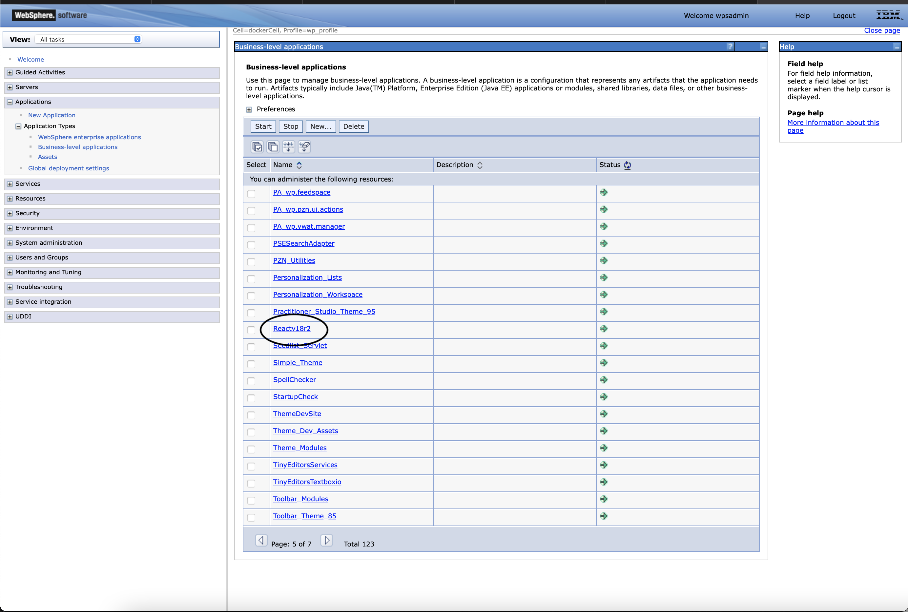
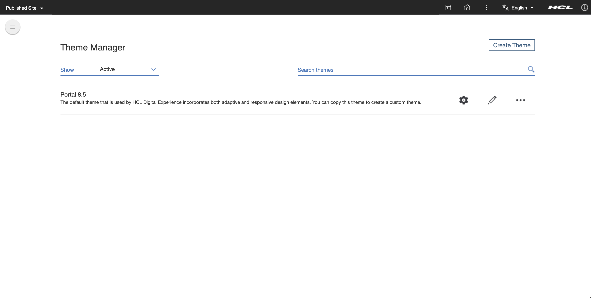
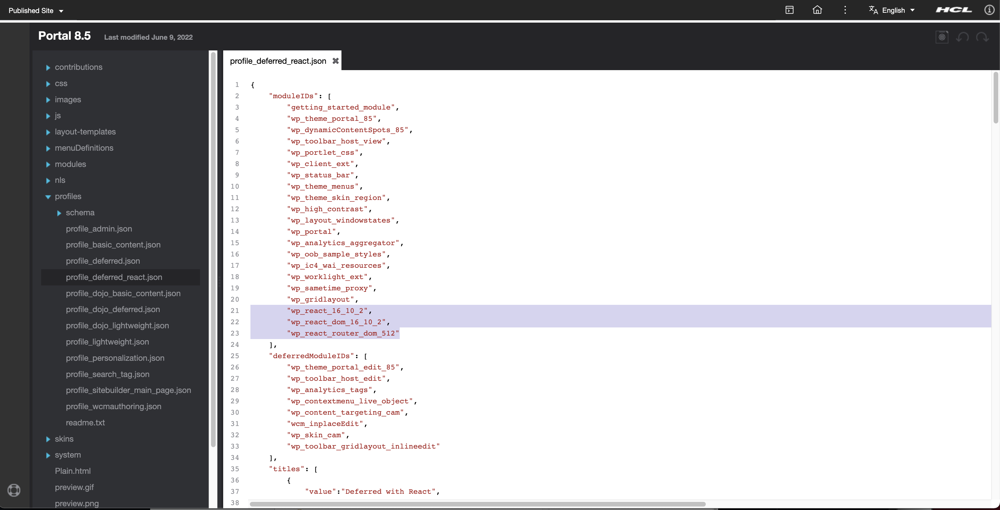
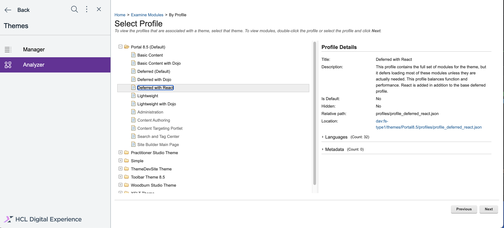
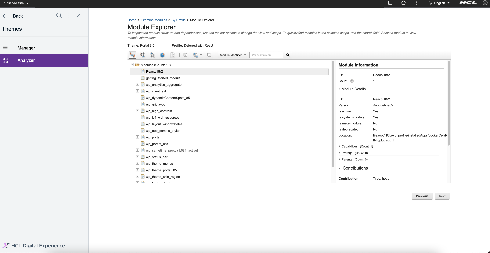

# Deploy JavaScript Libraries/Dependencies as a DX Module
This guide provides a streamlined build process that will automate the creation of the EAR file of DX modules and provides the capability to upload it to the DX Websphere Application Server (WebSphere).

Please make sure to read the [Important Configuration Items to Note](#important-configuration-items-to-note) section.

This Gradle Project includes the following areas of functionality:
- [Webpack](https://webpack.js.org/) build script to package JavaScript libraries into a Web Archive (WAR) file
- Replacement of names and labels in WebSphere deployment descriptors. 
- Packaging of the WAR file into an Enterprise Application Archive (EAR) file
- Deployment of the DX Module (EAR file) to WebSphere via DXClient

## PreRequisites

### Java Runtime Engine
- Java Runtime Engine with a Long Term Support (LTS) version is needed to be able to run the embedded Gradle wrapper in this project. Java version 17 is recommended.
### Optional: DXClient
- An option is available for the built DX Module (EAR file) to be uploaded to WebSphere via DXClient. You may read the documentation for DXClient [here](https://help.hcltechsw.com/digital-experience/9.5/containerization/dxclient.html). If you have replaced the default context root of your DX installation, you should update the [config.json](https://help.hcltechsw.com/digital-experience/9.5/containerization/dxclient.html) file of your DXClient accordingly.

 ```
    "dxContextRoot":"/wps",
    "contenthandlerPath": "/wps/mycontenthandler",
    "xmlConfigPath": "/wps/config",
```

## How To Create a Gradle Project for a DX Module
DX Modules are artifacts that may include bundled Javascript and Styling (CSS, SCSS) files that DX can then inject into the HTML header of the DX Pages. Frontend modules are aggregated by DX and then cached by browsers by default and will deliver performance improvements to the loading sequence of DX pages.

1. Add gradle wrapper scripts and library to your project.
   - Copy files from existing gradle projects. Recreate the folder structure in your new project.
      - gradle/wrapper/gradle-wrapper.jar
      - gradle/wrapper/gradle-wrapper.properties
      - gradlew
      - gradlew.bat
   - OR [install gradle](https://gradle.org/install/) and run [gradle wrapper](https://docs.gradle.org/current/userguide/gradle_wrapper.html#sec:adding_wrapper).
2. Create a gradle.properties file and set the node and npm version required. Set nodeInstall to false if the existing executables of the current environment is preferred. The gradle project included in this guide is going to be capable of downloading and using its own set of node and npm executables for the build process.
    ```
    nodeInstall=true
    nodeVersion=16.17.0
    npmVersion=8.15.0
    ```
   Add the details of the DX deployment target. They will be relayed as parameters whenever the DXClient executable is called by the deploy tasks.
    ```
    dxProtocol=https
    dxHostname=localhost
    dxPort=10041
    dxProfileName=wp_profile
    ```
3. Create or update the package.json file to enumerate the libraries that will be added to the DX Module.
    ```
    {
      "name": "webapp-dx-module",
      "version": "1.0.0",
      "description": "",
      "main": "modules-index.js",
      "scripts": {
        "test": "echo \"Error: no test specified\" && exit 1",
        "build-dxmodules": "webpack --config  webpack.dxmodules.js"
      },
      "author": "",
      "license": "ISC",
      "dependencies": {
        "react": "^18.2.0",
        "react-dom": "^18.2.0"
      },
      "devDependencies": {
        "css-loader": "^6.7.1",
        "file-loader": "^6.2.0",
        "mini-css-extract-plugin": "^2.6.0",
        "mini-svg-data-uri": "^1.4.4",
        "terser-webpack-plugin": "^5.3.3",
        "ts-loader": "^9.3.1",
        "typescript": "^4.7.4",
        "webpack": "^5.73.0",
        "webpack-cli": "^4.10.0"
      },
      "overrides": {}
    }     
    ```
   Make sure to set the main file to modules-index.js
    ```
    "main": "modules-index.js",
    ```
   Make sure to add the build-dx-modules among the scripts:
    ```
    "scripts": {
      ...
      "build-dxmodules": "webpack --config  webpack.dxmodules.js"
    },
    ```

4. Add a module-index.js file. Enumerate the Javascript libraries and components via import and export commands in the file. Provide descriptive aliases for the group of libraries and components that will be included.
    ```
        /* Import and Export Main Dependencies
        */
        import React from 'react';
        import ReactDOM from 'react-dom/client';
        export const ReactV18 = {
            React,
            ReactDOM,
        }
        
        /* Import and Export 3rd-Party Libraries
           sample:
                import { Table } from 'smart-webcomponents-react/table';
                import { Accordion, AccordionItem } from 'smart-webcomponents-react/accordion'
                export const SmartWebComponents = {
                    Table, Accordion, AccordionItem
                }   
         */
        
        /* Export Custom Data and/or Services
           sample:
                 export * as CommonData from './common/data/data';
         */
        
        /* Export index file for the styles (added here to be able to share the filename/alias of JS bundle in Webpack entry config). 
         */
        export * from './styles-index.css'
        
    ```
5. Add a styles-index.css file. Enumerate via import statements the component styling (CSS, SCSS, etc.) required that are not yet imported by any JS nor HTML files in the modules-index.js. Leave it empty if no imports are needed at the moment.
    ```
        /* sample import:
         *    @import 'smart-webcomponents-react/source/styles/smart.default.css';
        */
    ```
6. Add a settings.gradle file. Set the value of the rootProject.name. It will be used as the name of the DX Module (war file, ear file, etc.) and the names and ids in the deployment descriptors (web context path, etc.).
    ```
       rootProject.name = 'Reactv18r2'
    ```
7. Add a build.gradle file with the following content:
    ```
    plugins {
        id 'ear'
        id 'war'
        id "com.github.node-gradle.node" version "3.4.0"
    }
    
    group 'com.company.dx.module.custom'
    //version '1.0-SNAPSHOT'
    
    sourceCompatibility=11
    targetCompatibility=11
    
    repositories {
        mavenLocal()
        mavenCentral()
        maven {
            url "https://plugins.gradle.org/m2/"
        }
    }
    
    dependencies {
        deploy files(war)
    }
    
    task npmInstallDXModule(type: NpxTask) {
        workingDir = file("${project.projectDir}/src/main/WebAppDXModule")
        command = 'npm'
        args = ['install']
    }
    
    task npmBuildDxModule (type: NpxTask, dependsOn: 'npmInstallDXModule'){
        workingDir = file("${project.projectDir}/src/main/WebAppDXModule")
        command = 'npm'
        args = ['run','build-dxmodules']
    }
    
    //Processing the template files with proper data.
    task deleteWebXml{
        delete(file("build/tmp/war/web.xml"))
    }
    
    task prepareWebXml (type: Copy, dependsOn: 'deleteWebXml'){
        from 'src/main/config/war/web.xml'
        into 'build/tmp/war/'
        filter { it.replaceAll('@@auto-replaced-with-rootProject.name@@', rootProject.name) }
    }
    
    war {
        dependsOn npmBuildDxModule, prepareWebXml
        webAppDirectory = file('src/main/WebAppDXModule/static/')
        webXml = file('build/tmp/war/web.xml')
        from ('src/main/config/war/WEB-INF/') {
            include '*'
            into 'WEB-INF'
            filter { it.replaceAll('@@auto-replaced-with-rootProject.name@@', rootProject.name) }
        }
        from ('dist-dx-module') {
            include '*'
            into '/'
        }
        manifest {
            attributes 'Manifest-Version': 1
            attributes 'Created-By': rootProject.name
        }
    }
    
    ear {
        setLibDirName(null)
        deploymentDescriptor {
            setDisplayName(rootProject.name)
            webModule(rootProject.name+'.war', '/'+rootProject.name)
            setVersion('1.4')
        }
        from ('src/main/config/ear/META-INF/') {
            include '*'
            into 'META-INF'
        }
        manifest {
            attributes 'Manifest-Version': 1
            attributes 'Created-By': rootProject.name
        }
    }
    
    def getParamValue(String paramName){
        if (project.hasProperty(paramName)){
            return project.getProperty(paramName)
        }
        if (System.getProperties().containsKey(paramName)){
            return System.getProperty(paramName)
        }
        return ""
    }
    
    def checkRequiredParam(String paramName){
        if (getParamValue(paramName).trim()==""){
            throw new GradleException("#### Required gradle parameter or env value: -D$paramName=<****> OR -P$paramName=<****> ")
        }
    }
    
    task deployDxModule(type:Exec, dependsOn:'ear') {
        doFirst{
            checkRequiredParam("dxUsername")
            checkRequiredParam("dxPassword")
            logger.quiet('cd build/libs/')
            logger.quiet('dxclient deploy-application'+
                    ' --dxUsername ****'+
                    ' --dxPassword ****'+
                    ' --dxConnectUsername ****'+
                    ' --dxConnectPassword ****'+
                    ' --applicationFile '+ rootProject.name+'.ear'+
                    ' --applicationName '+ rootProject.name+
                    ' --dxProtocol '+ project.getProperty("dxProtocol")+
                    ' --hostname '+ project.getProperty("dxHostname")+
                    ' --dxPort '+ project.getProperty("dxPort")+
                    ' --dxProfileName '+ project.getProperty("dxProfileName"));
        }
        workingDir './build/libs'
        commandLine 'dxclient', 'deploy-application',
                    '--dxUsername', getParamValue("dxUsername"),
                    '--dxPassword', getParamValue("dxPassword"),
                    '--dxConnectUsername', getParamValue("dxUsername"),
                    '--dxConnectPassword', getParamValue("dxPassword"),
                    '--applicationFile', rootProject.name+'.ear',
                    '--applicationName', rootProject.name,
                    '--dxProtocol', project.getProperty("dxProtocol"),
                    '--hostname', project.getProperty("dxHostname"),
                    '--dxPort', project.getProperty("dxPort"),
                    '--dxProfileName', project.getProperty("dxProfileName")
        standardOutput = new ByteArrayOutputStream()
        ext.output = {
            return standardOutput.toString()
        }
    }
    
    /* Will be needed once DX ScriptApps are merged into this project
    def scriptApps = ['WebAppScriptApp01', 'WebAppScriptApp02']
    def allScriptAppsTasks = []
    
    scriptApps.each{ scriptApp ->
        def appName = scriptApp.replaceAll('WebApp','').replaceAll('webapp','').replaceAll('-','').replaceAll('_','');
        allScriptAppsTasks.add (
            tasks.create( 'npmInstall'+appName, NpxTask) {
                shouldRunAfter = ['deployDxModule']
                workingDir = file("${project.projectDir}/src/main/${scriptApp}")
                command = 'npm'
                args = ['install']
            });
        allScriptAppsTasks.add (
            tasks.create( 'npmBuild'+appName, NpxTask) {
                dependsOn = ['npmInstall'+appName]
                shouldRunAfter = ['deployDxModule']
                workingDir = file("${project.projectDir}/src/main/${scriptApp}")
                command = 'npm'
                args = ['run', 'build']
            });
        allScriptAppsTasks.add (
            tasks.create( 'deploy'+appName, NpxTask) {
                dependsOn = ['npmBuild'+appName]
                shouldRunAfter = ['deployDxModule']
                environment = ['dxUsername':getParamValue("dxUsername"),
                               'dxPassword':getParamValue("dxPassword"),
                               'dxProtocol':project.getProperty("dxProtocol"),
                               'dxHostname':project.getProperty("dxHostname"),
                               'dxPort':project.getProperty("dxPort")]
                workingDir = file("${project.projectDir}/src/main/${scriptApp}")
                command = 'npm'
                args = ['run', 'dx-deploy-app-use-env']
            });
    }
    
    task deployAllScriptApps(type:Exec, dependsOn: allScriptAppsTasks){
        // an array named allScriptAppsTasks was dynamically generated from the scriptApps array to contain all build tasks
        // all tasks needed were invoked via dependsOn parameter
        commandLine 'echo',' Task deployAllScriptApps Done'
    }
    
    task deployAll(type:Exec, dependsOn: ['deployDxModule', 'deployAllScriptApps']){
        // all tasks needed were invoked via dependsOn parameter
        commandLine 'echo',' Task deployAll Done'
    }
    
     */
    
    if (project.hasProperty("nodeInstall")) {
        // Workaround node grade plugin not working on apple silicon https://github.com/node-gradle/gradle-node-plugin/issues/154
        OperatingSystem os = org.gradle.nativeplatform.platform.internal.DefaultNativePlatform.getCurrentOperatingSystem()
        Architecture arch = org.gradle.nativeplatform.platform.internal.DefaultNativePlatform.getCurrentArchitecture()
        Boolean downloadNode = !os.isMacOsX() || arch.isAmd64()
        node {
            version = project.getProperty("nodeVersion")
            npmVersion = project.getProperty("npmVersion")
            download = downloadNode
        }
    
        // Copy local node and npm to a fixed location for npmw
        def fixedNode = tasks.register("fixedNode", Copy) {
            from nodeSetup
            into 'build/node'
        }
        tasks.named("nodeSetup").configure { finalizedBy fixedNode }
    
        def fixedNpm = tasks.register("fixedNpm", Copy) {
            from npmSetup
            into 'build/node'
        }
        tasks.named("npmSetup").configure { finalizedBy fixedNpm }
    }
    
    ```
8. Add a webpack.dxmodules.js file.
    ```
    const path = require("path");
    const TerserPlugin = require("terser-webpack-plugin");
    const MiniCssExtractPlugin = require('mini-css-extract-plugin');
    const { DllPlugin } = require('webpack');
    const svgToMiniDataURI = require('mini-svg-data-uri');
    
    module.exports = {
        entry: {
            dxmodules: './modules-index.js'
        },
        mode: "production",
        target: 'node',
        output: {
            filename: "[name].bundle.js",
            path: path.resolve(__dirname, "dist-dx-module"),
            library: "[name]_[fullhash]"
        },
        plugins: [
            new DllPlugin({
                name: "[name]_[fullhash]",
                path: path.resolve(__dirname, "./dx-dll-manifest.json"),
                format: true,
            }),
            new MiniCssExtractPlugin({
                filename: "[name].bundle.css",
            })
        ],
        resolve: {
            extensions: ['.ts', '.js', '.json']
        },
        optimization: {
            minimizer: [
                new TerserPlugin(),
            ]
        },
        module: {
            rules: [
                {
                    test: /\.(js|mjs|jsx|ts|tsx)$/,
                    use: 'ts-loader',
                    exclude: /node_modules/,
                },
                {
                    test: /\.css$/,
                    use: [
                        MiniCssExtractPlugin.loader,
                        'css-loader'
                    ],
                    exclude: [
                        /smart-/
                    ]
                },
                {
                    test: /\.scss$/,
                    use: [
                        MiniCssExtractPlugin.loader,
                        'css-loader',
                        'sass-loader'
                    ],
                },
                {
                    test: /\.svg/,
                    type: 'asset/inline',
                    generator: {
                        dataUrl: content => {
                            content = content.toString();
                            return svgToMiniDataURI(content);
                        }
                    }
                },
                {
                    test: /\.(png|jpg|jpeg|gif|woff|woff2|ttf|eot)$/,
                    type: 'asset'
                },
            ]
        },
    };
        
    ```
9. Create the was.policy file in the src/main/config/ear/META-INF folder:
    ```
    //
    // Template policy file for enterprise application.
    // Extra permissions can be added if required by the enterprise application.
    //
    // NOTE: Syntax errors in the policy files will cause the enterprise application FAIL to start.
    //       Extreme care should be taken when editing these policy files. It is advised to use
    //       the policytool provided by the JDK for editing the policy files
    //       (WAS_HOME/java/jre/bin/policytool). 
    //
    
    grant codeBase "file:${application}" {
        permission java.security.AllPermission;
    };
    
    grant codeBase "file:${jars}" {
        permission java.security.AllPermission;
    };
    
    grant codeBase "file:${connectorComponent}" {
        permission java.security.AllPermission;
    };
    
    grant codeBase "file:${webComponent}" {
        permission java.security.AllPermission;
    };
    
    grant codeBase "file:${ejbComponent}" {
        permission java.security.AllPermission;
    };
    
    ```
10. Create the ibm-web-bnd.xmi file in the src/main/config/war/WEB-INF folder:
    ```
    <?xml version="1.0" encoding="UTF-8"?>
    <webappbnd:WebAppBinding xmi:version="2.0" xmlns:xmi="http://www.omg.org/XMI" xmlns:webappbnd="webappbnd.xmi" xmi:id="WebAppBinding_1203959801006" virtualHostName="default_host">
      <webapp href="WEB-INF/web.xml#@@auto-replaced-with-rootProject.name@@"/>
    </webappbnd:WebAppBinding>
    ```
11. Create the ibm-web-ext.xmi file in the src/main/config/war/WEB-INF folder:
    ```
    <?xml version="1.0" encoding="UTF-8"?>
    <webappext:WebAppExtension xmi:version="2.0" xmlns:xmi="http://www.omg.org/XMI" xmlns:webappext="webappext.xmi" xmi:id="WebAppExtension_1203959801006" reloadInterval="3" reloadingEnabled="true" additionalClassPath="" fileServingEnabled="true" directoryBrowsingEnabled="false" serveServletsByClassnameEnabled="false" preCompileJSPs="false">
      <webApp href="WEB-INF/web.xml#@@auto-replaced-with-rootProject.name@@"/>
      <jspAttributes xmi:id="JSPAttribute_1" name="jdkSourceLevel" value="15"/>
      <jspAttributes xmi:id="JSPAttribute_2" name="keepgenerated" value="false"/>
    </webappext:WebAppExtension>
    ```
12. Create the plugin.xml file in the src/main/config/war/WEB-INF folder:
    ```
    <?xml version="1.0" encoding="UTF-8" standalone="yes"?>
    <?eclipse version="3.0"?>
    <plugin id="@@auto-replaced-with-rootProject.name@@" name="@@auto-replaced-with-rootProject.name@@" version="1.0.0" provider-name="IBM">
    
        <extension point="com.ibm.portal.resourceaggregator.module" id="@@auto-replaced-with-rootProject.name@@">
            <module id="@@auto-replaced-with-rootProject.name@@">
                <contribution type="head">
                    <sub-contribution type="js">
                        <uri value="res:{war:context-root}/dxmodules.bundle.js"/>
                        <uri type="debug" value="res:{war:context-root}/dxmodules.bundle.js"/>
                    </sub-contribution>
                </contribution>
                <contribution type="head">
                    <sub-contribution type="css">
                        <uri value="res:{war:context-root}/dxmodules.bundle.css"/>
                        <uri type="debug" value="res:{war:context-root}/dxmodules.bundle.css"/>
                    </sub-contribution>
                </contribution>
            </module>
        </extension>
    </plugin>
    ```
13. Create the template web.xml file in the src/main/config/war folder:
    ```
    <?xml version="1.0" encoding="UTF-8"?>
    <web-app id="@@auto-replaced-with-rootProject.name@@" version="2.4" xmlns="http://java.sun.com/xml/ns/j2ee" xmlns:xsi="http://www.w3.org/2001/XMLSchema-instance" xsi:schemaLocation="http://java.sun.com/xml/ns/j2ee http://java.sun.com/xml/ns/j2ee/web-app_2_4.xsd">
        <display-name>@@auto-replaced-with-rootProject.name@@</display-name>
        <context-param>
            <description>A regular expression that defines which of the resources in the war file can be served by the portal res datasource.</description>
            <param-name>com.ibm.portal.resource.whitelist</param-name>
            <param-value>.*</param-value>
        </context-param>
        <context-param>
            <description>A regular expression that defines which of the resources in the war file cannot be served by the portal res datasource.</description>
            <param-name>com.ibm.portal.resource.blacklist</param-name>
            <param-value>WEB-INF/.*</param-value>
        </context-param>
    </web-app>
    ```
14. Add a tsconfig.json file:
    ```
    {
      "compilerOptions": {
        "outDir": "./dist/",
        "noImplicitAny": true,
        "module": "es6",
        "target": "es5",
        "allowJs": true,
        "moduleResolution": "node",
        "resolveJsonModule": true,
        "esModuleInterop": true
      }
    }
    ```
## How To Build and Deploy DX Modules
1. Build and deploy the DX module with the following command. Change the `{username}` and `{password}` with the proper admin credentials. If you wish to manually upload the EAR file, use the _npmBuildDxModule_ task (without the -D parameters) instead of the _deployDxModule_ in the commands below.

   **For Uploads via DXClient:**

   - On non-Windows machine
   ```
    ./gradlew deployDxModule -DdxUsername={username} -DdxPassword={password}
   ```
   - On Windows machine
   ```
    gradlew.bat deployDxModule -DdxUsername={username} -DdxPassword={password}
   ```
   Sample successful _deployDxModule_ log:
   ```
        > Task :npmInstallDXModule
        up to date, audited 167 packages in 932ms
        24 packages are looking for funding
          run `npm fund` for details
        found 0 vulnerabilities
        > Task :npmBuildDxModule
        > webapp-dx-module@1.0.0 build-dxmodules
        > webpack --config  webpack.dxmodules.js
        asset dxmodules.bundle.js 137 KiB [compared for emit] [minimized] (name: dxmodules) 1 related asset
        asset dxmodules.bundle.css 97 bytes [compared for emit] (name: dxmodules)
        Entrypoint dxmodules 137 KiB = dxmodules.bundle.css 97 bytes dxmodules.bundle.js 137 KiB
        orphan modules 2.89 KiB (javascript) 937 bytes (runtime) [orphan] 8 modules
        runtime modules 670 bytes 3 modules
        built modules 143 KiB (javascript) 96 bytes (css/mini-extract) [built]
          modules by path ./node_modules/ 142 KiB
            modules by path ./node_modules/react-dom/ 131 KiB 3 modules
            modules by path ./node_modules/react/ 6.94 KiB
              ./node_modules/react/index.js 190 bytes [built] [code generated]
              ./node_modules/react/cjs/react.production.min.js 6.75 KiB [built] [code generated]
            modules by path ./node_modules/scheduler/ 4.33 KiB
              ./node_modules/scheduler/index.js 198 bytes [built] [code generated]
              ./node_modules/scheduler/cjs/scheduler.production.min.js 4.14 KiB [built] [code generated]
          dll dxmodules 12 bytes [built] [code generated]
          ./modules-index.js 764 bytes [built] [code generated]
          css ./node_modules/css-loader/dist/cjs.js!./styles-index.css 96 bytes [built] [code generated]
        webpack 5.74.0 compiled successfully in 9087 ms
        > Task :deployDxModule
        cd build/libs/
        dxclient deploy-application --dxUsername **** --dxPassword **** --dxConnectUsername **** --dxConnectPassword **** --applicationFile Reactv18r2.ear --applicationName Reactv18r2 --dxProtocol https --hostname localhost --dxPort 10041 --dxProfileName wp_profile
        BUILD SUCCESSFUL in 1m 41s
        10 actionable tasks: 6 executed, 4 up-to-date
   ```
   **To prepare for manual uploads:**

   - On non-Windows machine
   ```
    ./gradlew npmBuildDxModule
   ```
   - On Windows machine
   ```
    gradlew.bat npmBuildDxModule
   ```
   Sample successful _npmBuildDxModule_ log:
   ```
        > Task :npmInstallDXModule
        up to date, audited 167 packages in 979ms
        24 packages are looking for funding
          run `npm fund` for details
        found 0 vulnerabilities
        > Task :npmBuildDxModule
        > webapp-dx-module@1.0.0 build-dxmodules
        > webpack --config  webpack.dxmodules.js
        asset dxmodules.bundle.js 137 KiB [compared for emit] [minimized] (name: dxmodules) 1 related asset
        asset dxmodules.bundle.css 97 bytes [compared for emit] (name: dxmodules)
        Entrypoint dxmodules 137 KiB = dxmodules.bundle.css 97 bytes dxmodules.bundle.js 137 KiB
        orphan modules 2.89 KiB (javascript) 937 bytes (runtime) [orphan] 8 modules
        runtime modules 670 bytes 3 modules
        built modules 143 KiB (javascript) 96 bytes (css/mini-extract) [built]
          modules by path ./node_modules/ 142 KiB
            modules by path ./node_modules/react-dom/ 131 KiB 3 modules
            modules by path ./node_modules/react/ 6.94 KiB
              ./node_modules/react/index.js 190 bytes [built] [code generated]
              ./node_modules/react/cjs/react.production.min.js 6.75 KiB [built] [code generated]
            modules by path ./node_modules/scheduler/ 4.33 KiB
              ./node_modules/scheduler/index.js 198 bytes [built] [code generated]
              ./node_modules/scheduler/cjs/scheduler.production.min.js 4.14 KiB [built] [code generated]
          dll dxmodules 12 bytes [built] [code generated]
          ./modules-index.js 764 bytes [built] [code generated]
          css ./node_modules/css-loader/dist/cjs.js!./styles-index.css 96 bytes [built] [code generated]
        webpack 5.74.0 compiled successfully in 10093 ms
        BUILD SUCCESSFUL in 52s
        6 actionable tasks: 4 executed, 2 up-to-date
   ```
3. If you intend to manually upload the EAR file, follow this [guide](#optional-how-to-manually-upload-the-ear-file-to-websphere) and skip step #4 below.
4. In case the _deployDxModule_ task returned an error, check the dxclient logs in build/libs/store/logs/ folder.
5. Please read the [Important Configuration Items to Note](#important-configuration-items-to-note).
6. Verify and link the DX Module to a DX Theme. Follow this [guide](#how-to-verify-a-successful-deployment-and-link-a-dx-module-to-a-dx-theme).

## Optional: How to manually upload the EAR file to WebSphere
1. Check the EAR file generated in the build/libs folder.
2. Login to your WebSphere console.
3. Navigate to the new application window by opening the Application tab in the left-hand side and then click the new application link.
   
4. Click the New Enterprise Application link
5. Click the Browse button to select the newly generated EAR file in the new directory `build/libs`
   
6. For now, you can click the next buttons as you go through the Install New Application process.
7. Click the Finish button when you arrive in the last step.
   
8. The upload progress will be shown next.
   
9. When it is done, click the Save link near the bottom.
   

# Important Configuration Items to Note
1. Take note of the location of the generated DLL manifest as configured in the DllPlugin section of webpack.dxmodules.js. The location and content of the manifest are critical as it is required to optimize and correctly build the dependent DX ScriptApps.
   ```
    entry: {
        dxmodules: './modules-index.js'
    },
    mode: "production",
    target: 'node',
    output: {
        filename: "[name].bundle.js",
        path: path.resolve(__dirname, "dist-dx-module"),
        library: "[name]_[fullhash]"
    },
    plugins: [
        new DllPlugin({
            name: "[name]_[fullhash]",
            path: path.resolve(__dirname, "./dx-dll-manifest.json"),
            format: true,
        }),
        new MiniCssExtractPlugin({
            filename: "[name].bundle.css",
        })
    ],
   ```
2. Take note of the generated library name (with the added fullhash) and the exported component aliases in the generated DLL manifest (dx-dll-manifest.json). Please keep in mind that even minor edits in the DX module will result to a modified fullhash in the library name that will then require the dependent DX ScriptApps to be rebuilt and redeployed. It is recommended to keep the fullhash suffix in the webpack library name config mentioned in previous step.
   ```
    {
      "name": "dxmodules_2a35376eb9d458555803",
      "content": {
        "./modules-index.js": {
          "id": 239,
          "buildMeta": {
            "tsLoaderDefinitionFileVersions": [
              "node_modules/terser-webpack-plugin/types/index.d.ts@0",
              "node_modules/terser-webpack-plugin/types/utils.d.ts@0",
              ...
              "node_modules/react/index.js@?",
              "node_modules/react-dom/client.js@?"
            ],
            "tsLoaderFileVersion": 0,
            "exportsType": "namespace"
          },
          "exports": [
            "ReactV18"
          ]
        }
      }
    }
   ```
3. Any change in the aliases in both the entry config or in the output filenames in webpack.dxmodules.js, will require corresponding changes to DX Module's deployment descriptor file src/main/config/war/WEB-INF/plugin.xml. The Javascript and styling files in the output folder dist-dx-module must correspond to the files listed in the  deployment descriptor. All @@auto-replaced-with-rootProject.name@@ tokens are dynamically replaced by the rootProject.name value set in settings.gradle.
   ```
    ...
    <module id="@@auto-replaced-with-rootProject.name@@">
        <contribution type="head">
            <sub-contribution type="js">
                <uri value="res:{war:context-root}/dxmodules.bundle.js"/>
                <uri type="debug" value="res:{war:context-root}/dxmodules.bundle.js"/>
            </sub-contribution>
        </contribution>
        <contribution type="head">
            <sub-contribution type="css">
                <uri value="res:{war:context-root}/dxmodules.bundle.css"/>
                <uri type="debug" value="res:{war:context-root}/dxmodules.bundle.css"/>
            </sub-contribution>
        </contribution>
    </module>
    ...
   ```

# How To Verify A Successful Deployment and Link a DX Module to a DX Theme
1. To verify, login to the WebSphere console. Under the *Applications* tab, then the *Application Types* and then lastly in the *Business-level applications*, you can search for your application name in the table in the right-hand side.
   
2. To verify inside HCL Digital Experience:
   Click Theme button in Practitioner Studio Home Page
   
   Click the Menu button at the upper left most part of the screen
   
   Click the Manager Menu at the left side
   
   Click Pencil Button at the right side of the theme to be used (i.e. Portal 8.5)
   
   Go to profiles->profile_deferred_react.json then remove the 3 highlighted moduleIDs
   
   Add the new module (i.e. Reactv18r2). Click on the Save button (disc icon) in the upper right area.
   
   Click the Analyzer Menu then click the Examine modules by profile
   
   Navigate to Examine modules by profile and click the module used then click Next button
   
   Expand Modules and the module uploaded must be there (i.e. Reactv18r2). Note: there must be no warning icon in the uploaded module.
   


# Additional Information: File structure
```
📦02DependenciesAsModule
 ┣ 📂gradle                     - The files being used by the Gradle wrapper
 ┃ ┗ 📂wrapper
 ┃ ┃ ┣ 📜gradle-wrapper.jar
 ┃ ┃ ┗ 📜gradle-wrapper.properties
 ┣ 📂src
 ┃ ┗ 📂main
 ┃ ┃ ┗ 📂config
 ┃ ┃ ┃ ┣ 📂ear                  - Template files that will be used when building the EAR file which will be deployed to WebSphere. 
 ┃ ┃ ┃ ┃ ┗ 📂META-INF
 ┃ ┃ ┃ ┃ ┃ ┗ 📜WebSphere.policy
 ┃ ┃ ┃ ┗ 📂war                  - Template files that will be used when building the WAR file inside the EAR file.
 ┃ ┃ ┃ ┃ ┣ 📂WEB-INF
 ┃ ┃ ┃ ┃ ┃ ┣ 📜ibm-web-bnd.xmi
 ┃ ┃ ┃ ┃ ┃ ┣ 📜ibm-web-ext.xmi
 ┃ ┃ ┃ ┃ ┃ ┗ 📜plugin.xml
 ┃ ┃ ┃ ┃ ┗ 📜web.xml
 ┣ 📜.gitignore
 ┣ 📜README.MD
 ┣ 📜build.gradle               - This file is the build program being used to build the EAR file which will be deployed to the WebSphere.
 ┣ 📜gradle.properties          - The environment property variables being used by the Gradle program.
 ┣ 📜gradlew                    - The wrapper that you will be using to run the program without needing the Gradle installed on a non-Windows machine.
 ┣ 📜gradlew.bat                - The wrapper that you will be using to run the program without needing the Gradle installed on a Windows machine.
 ┣ 📜index.js                   - Exports the modules you are using; this is used by the webpack.
 ┣ 📜package-lock.json
 ┣ 📜package.json               - The usual package.json of NPM
 ┣ 📜settings.gradle            - The environment settings variables being used by the Gradle program.
 ┗ 📜webpack.dx-module.js       - This is the webpack profile configuration that is being used by package.json.
 ```

- ### build.gradle
This file is the build script being used to build the EAR file which will be deployed to WebSphere. This processes all the files in main server alongside with the related properties to be able to generate the EAR file which will be deployed into the WebSphere.
- ### gradle.properties
The environment settings variables being used by the Gradle program. This is where you need to set whether you want the NPM to be used is project wide or local instance. This also include the WebSphere settings you need to configure before being to leverage the automatic deployment properly.
- ### webpack.dx-module.js
This is the webpack profile configuration that is being used by package.json.
- ### index.js
This file is what references the modules you are building.
- ### package.json & package-lock.json
These are the usual files needed for the NPM to work.
- ### EAR
The files you are building for the EAR file alongside the WAR file which will also be built by the program.
- ### WAR/WEB-INF
The files needed by the webapp you are building.
- ### WAR/web.xml
The deployment descriptor of your webapp.
- ### gradlew & gradlew.bat
These are the wrappers that you will be using to run the program without needing the Gradle installed in your machine.
- ### build/libs
This is where the generated EAR file be placed. This is the EAR file that will be deployed in the WebSphere.
